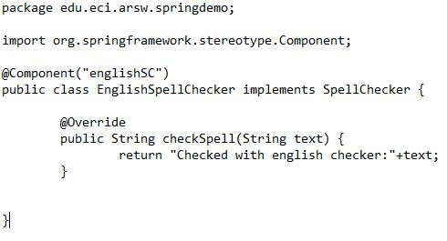
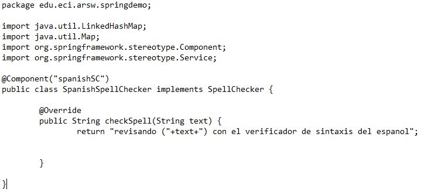

# Lab03-ARSW

# Part I - Basic workshop

3. Making use of the Spring configuration based on annotations mark with the annotations @Autowired and @Service the dependencies that must be injected, and the 'beans' candidates to be injected -respectively-

Anotaciones realizadas

Componentes:

