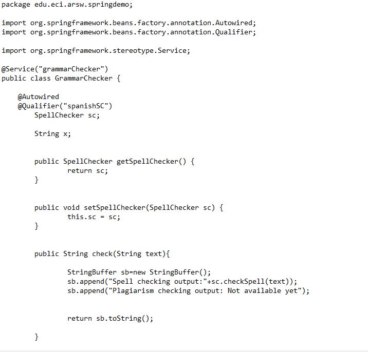

# Lab03-ARSW

# Part I - Basic workshop

1.Open the project sources in NetBeans.

2.Review the Spring configuration file already included in the project (src / main / resources). It indicates that Spring will automatically search for the 'Beans' available in the indicated package.

3. Making use of the Spring configuration based on annotations mark with the annotations @Autowired and @Service the dependencies that must be injected, and the 'beans' candidates to be injected -respectively-

Anotaciones realizadas

Componentes:

# Part II - Blueprint Management 1

1. Implmentacion de las operaciones getBluePrint() y getBlueprintsByAuthor() 

2.Make a program in which you create (through Spring) an instance of BlueprintServices, and rectify its functionality: register plans, consult plans, register specific plans, etc.

3. Filtros:

(A) Redundancy filtering: deletes consecutive points from the plane that are repeated.

(B) Subsampling filtering: suppresses 1 out of every 2 points in the plane, interspersed. 

4.Con el fin de realizar las pruebas que se cumplan para cada tipo de filtro. Ser realizan de la siguiente forma

Como se puede ver en la imagen solamente se debe cambiar el nombre del filtro que se quiere en la la clase de servicio con el fin de obtener diferentes resultados

